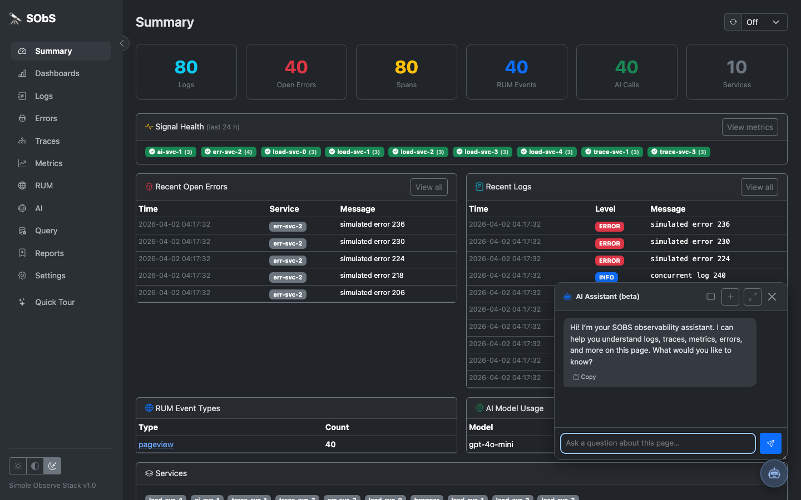
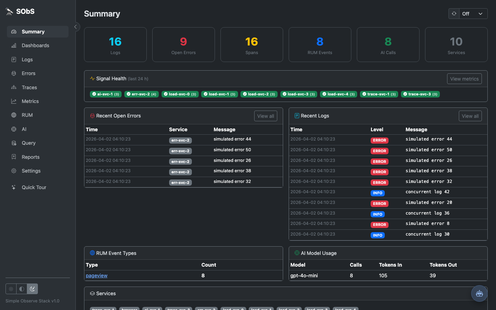
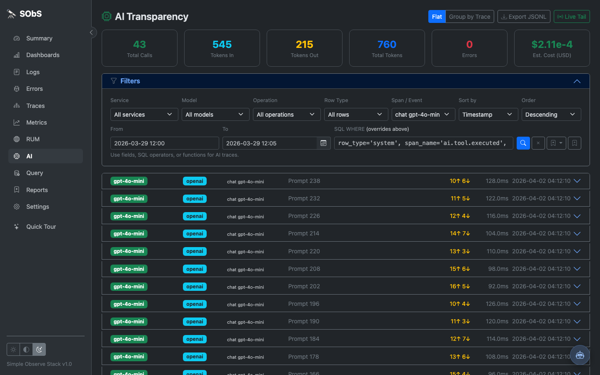
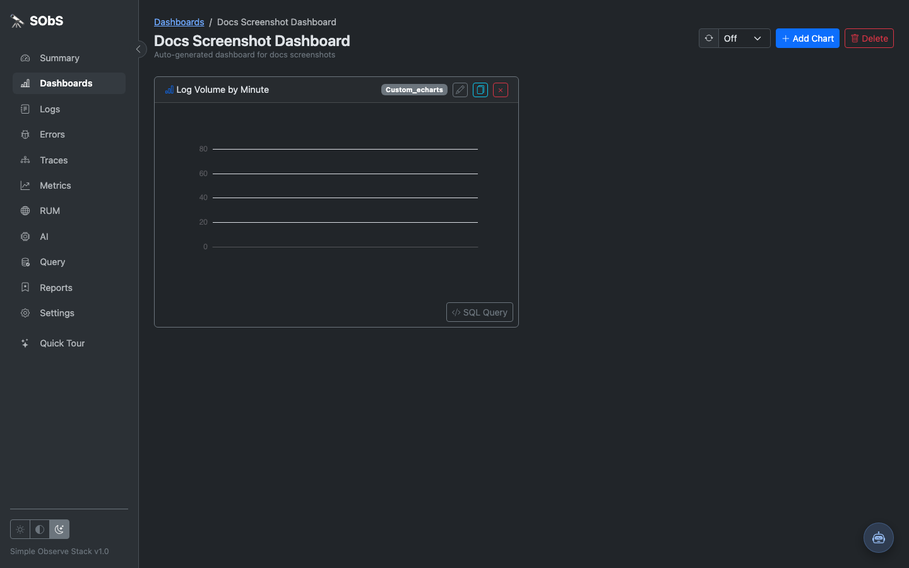
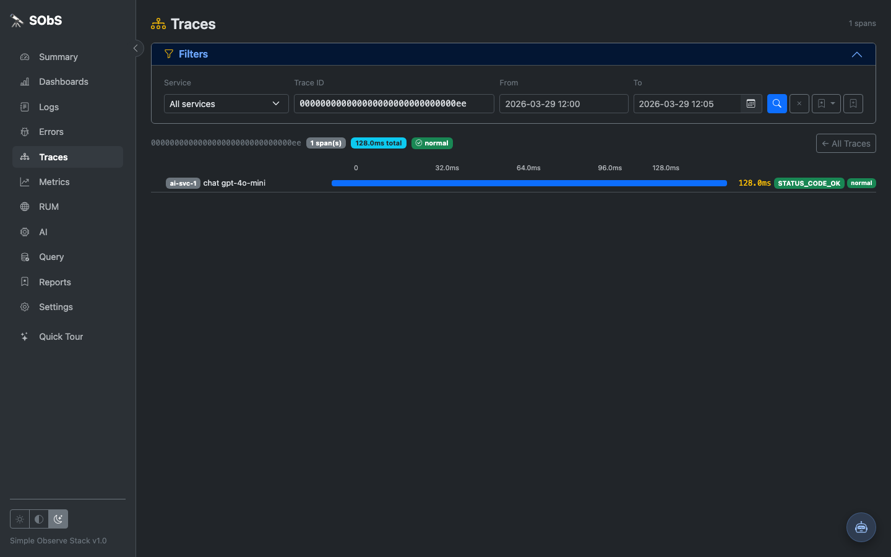
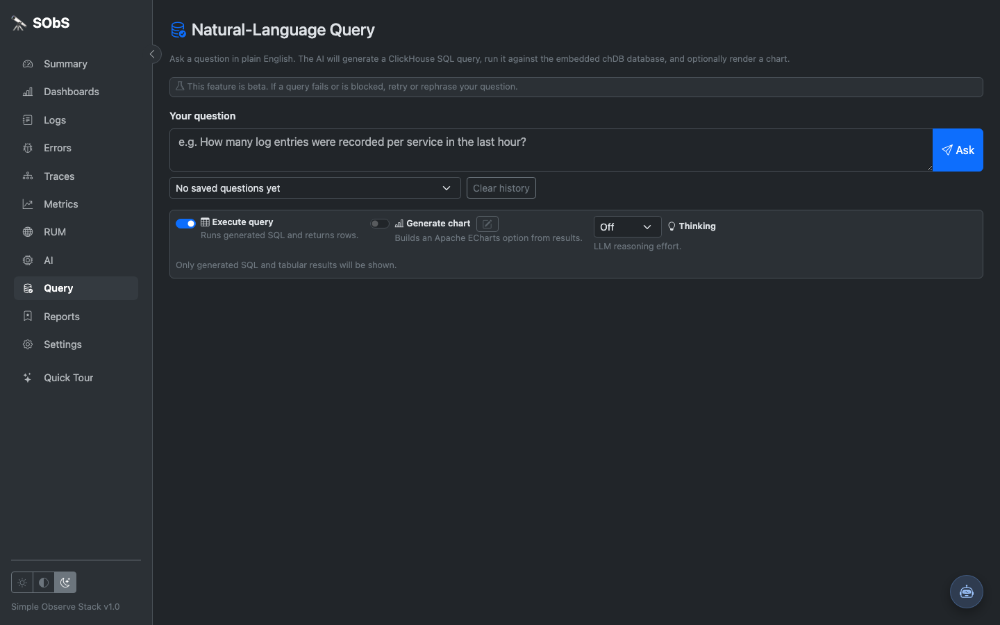

# SOBS – Simple Observe Stack

**SOBS** is a lightweight, single-user OpenTelemetry-compatible telemetry container focused on simplicity and transparency. It collects **Logs**, **Errors**, **Traces**, **RUM** (Real User Monitoring), and **AI call transparency** — all in one tiny container you can run as a standalone pod or sidecar.



## Features

- 📦 **Tiny** – single Python service + embedded chDB, ~256 MB RAM target
- 🗜️ **Compressed storage** – MergeTree schema uses ZSTD with selective Delta/T64 codecs
- 🔭 **OpenTelemetry** – accepts OTLP (JSON and protobuf) for logs, traces, metrics
- 🌐 **RUM** – client-side JS snippet with Web Vitals (LCP, CLS, INP, TTFB, FCP)
- 🐛 **Error tracking** – with stack traces and one-click resolve
- 🤖 **AI transparency** – record LLM prompts, responses and token usage
- 💬 **Contextual AI Assistant** – bottom-right in-app assistant for page-aware help and guided UI actions
- 🔍 **Search** – grep (regex) and SQL WHERE clause filtering on logs
- 🏷️ **Tag-aware log SQL assistant** – `has_tag()` helper, SQL filter validation, and field hints/autocomplete on Logs
- 📊 **Query statistics** – collapsible logs analytics panel with query-scoped level/service distributions
- 🧠 **Manual advanced log analysis** – on-demand message pattern clustering, keyword signals, and optimization hints
- 📚 **Saved reports** – persist and re-apply filter sets across Logs, Traces, Errors, Metrics, RUM, and AI pages
- 🧮 **Natural-language Query page** – NL→SQL over embedded chDB with read-only SQL guardrails and chart/dashboard actions
- 🔔 **Notifications & Webhooks** – Slack, webhook, email, and browser push channels with rule-based dispatch
- 📡 **Live tail** – SSE endpoint (`/tail`) for real-time streaming of logs and traces
- ⚡ **Live logs mode** – optional in-page streaming on Logs with pause-on-scroll and queued event counter
- 📈 **Metrics & Signals** – top-level Metrics page with derived telemetry signals and anomaly status
- 🧩 **Auto rule generation** – preview/create metric anomaly rules from recent derived-signal history
- 🗂️ **Auto dashboard generation** – build a derived-signal dashboard directly from active metric rules
- ✨ **First-run visual tour** – one-time onboarding modal with flow overview and quick-tour reopen entry
- 🎨 **Bootstrap 5 theming** – served locally with light/dark/system theme toggle, no CDN required
- 🐳 **Docker ready** – Dockerfile + docker-compose + Kubernetes manifests

## Quick Start

```bash
# Docker
docker run -p 44317:4317 -v sobs_data:/data ghcr.io/abartrim/sobs:latest

# docker-compose
docker-compose up -d

# Python (dev)
pip install -r requirements.txt
python app.py
```

Note: `python app.py` runs Hypercorn with a Quart ASGI app in single-process mode.

Open `http://localhost:44317` in your browser.

On first open, SOBS shows a lightweight visual onboarding tour (ingest → analyze → act). You can reopen it any time from the left nav via **Quick Tour**.

Prebuilt image published by CI:

`ghcr.io/abartrim/sobs:latest`

## Runtime Modes

- Local and production process manager:
  - `python app.py` starts Hypercorn.
  - With embedded chDB, keep a single process by default.
  - Equivalent explicit command:

```bash
hypercorn --workers 1 --bind 0.0.0.0:${PORT:-44317} app:app
```

Why: embedded chDB is process-sensitive. Multiple process workers can trigger DB lock/stall behavior in embedded mode.

## Sending Data

### Python – OpenTelemetry SDK

```bash
pip install opentelemetry-sdk opentelemetry-exporter-otlp-proto-http
python examples/python/otel_example.py
```

### Flask auto-instrumentation

```bash
pip install opentelemetry-instrumentation-flask opentelemetry-exporter-otlp-proto-http
python examples/python/flask_example.py
```

### Node.js / Express

```bash
cd examples/nodejs && npm install && node example.js
```

### curl (no SDK)

```bash
bash examples/curl_examples.sh
```

### Prometheus / OTEL metrics (OTel Collector bridge)

Forward existing Prometheus `/metrics` endpoints into SOBS using the OpenTelemetry
Collector as a bridge.  No changes are required to the instrumented application.

```bash
# Full local stack: SOBS + OTel Collector + demo app
docker compose -f examples/prometheus/docker-compose.yml up -d
```

Or push OTLP metrics directly from Python without a scrape endpoint:

```bash
pip install opentelemetry-sdk opentelemetry-exporter-otlp-proto-http prometheus_client
python examples/prometheus/python_metrics_example.py --mode push
```

See [`examples/prometheus/README.md`](examples/prometheus/README.md) for full configuration
details, security considerations, and limitations.

### Client-side RUM

```html
<script src="http://YOUR_SOBS_HOST/static/rum.js"></script>
<script>
  SOBS.init({ endpoint: 'http://YOUR_SOBS_HOST/v1/rum', appName: 'my-app' });
</script>
```

## OTLP Endpoints

| Endpoint       | Method | Description                        |
|----------------|--------|------------------------------------|
| `/v1/logs`     | POST   | OTLP/JSON logs                     |
| `/v1/traces`   | POST   | OTLP/JSON traces                   |
| `/v1/metrics`  | POST   | OTLP/JSON metrics (typed metric tables + anomaly views) |
| `/v1/rum`      | POST   | RUM events (JSON array)            |
| `/v1/errors`   | POST   | Direct error submission            |
| `/v1/ai`       | POST   | AI/LLM call transparency           |
| `/health`      | GET    | Liveness check                     |
| `/health/db`   | GET    | DB readiness check (touches chDB) |

Ingest writes are queued and flushed by a single background DB writer thread.

- Default runtime behavior: ingest endpoints acknowledge once the write is queued.
- Test behavior (`app.config["TESTING"] = True`): writes wait for batch completion so tests assert committed state deterministically.
- If the queue is saturated, ingest returns `503` so clients can retry/backoff.

This model favors client latency under burst traffic. It does not guarantee synchronous commit-per-request in normal runtime.

## Metrics Rules Automation

SOBS includes two automation flows under **Metrics → Metrics Rules**:

- **Auto Make Metric Rules**: generates threshold rules from recent derived-signal history with a preview-first workflow and capped create.
- **Auto Generate Dashboard from Active Rules**: creates/updates a dashboard with one derived-signal overlay chart per matching active rule (preview-first, max chart cap, skip-existing by title).

Both auto panels include contextual help and retain their open/collapsed scope across preview/create interactions.

Fresh chDB databases are created with schema compression tuned using ZSTD plus selective Delta/T64 codecs. For encrypted local-disk testing in the container image, set `SOBS_CHDB_ENCRYPTION_KEY` and SOBS will render an internal ClickHouse config at startup and pass it to chDB automatically.

Use `/health/db` for readiness checks in orchestrated deployments when you need the probe to exercise DB availability as well as process liveness.

## Saved Reports

SOBS supports saved report presets for page filters.

- Save the current filter state from Logs, Traces, Errors, Metrics, RUM, or AI.
- Re-apply saved reports from page-level report pickers or from the dedicated **Reports** page.
- Delete reports from the **Reports** page when no longer needed.

API endpoints:

- `GET /api/reports?page_type=<logs|traces|errors|metrics|rum|ai>`
- `POST /api/reports`
- `DELETE /api/reports/<report_id>`

UI routes:

- `GET /reports`

## Query Page (Natural Language → SQL)

SOBS includes a dedicated **Query** page that turns natural-language prompts into read-only SQL against embedded chDB.

- Query availability is automatic when AI endpoint and model settings are configured.
- SQL is restricted to read-only statements (`SELECT`, `EXPLAIN`, `SHOW`, `DESCRIBE`, `WITH`).
- Query execution is row-capped by `SOBS_QUERY_MAX_ROWS` (default `1000`).
- Query results can generate chart JSON and be added to an existing dashboard.

Routes:

- `GET /query`
- `POST /api/query/ask`
- `POST /api/query/run`
- `POST /api/query/refine-chart`
- `POST /api/query/add-to-dashboard`
- `GET /api/query/schema`

## Notifications & Webhooks

SOBS provides rule-driven notifications under **Settings → Notifications & Webhooks**.

- Channel types: `webhook`, `slack`, `email`, `browser_push`.
- Browser push supports VAPID keys from env (`SOBS_VAPID_PRIVATE_KEY`) or DB-backed key generation in the settings UI.
- Notification checks are exposed as an API for external schedulers (cron, Kubernetes CronJob, etc.).

Operational trigger endpoint:

- `POST /api/notifications/check`

## Configuration

| Variable                    | Default        | Description                                      |
|-----------------------------|----------------|--------------------------------------------------|
| `SOBS_DATA_DIR`             | `./data`       | Directory for embedded chDB state                |
| `SOBS_API_KEY`              | _(empty)_      | Optional auth key for ingest endpoints           |
| `SOBS_BASIC_AUTH_USERNAME`  | _(empty)_      | Optional Basic Auth username for the Web UI      |
| `SOBS_BASIC_AUTH_PASSWORD`  | _(empty)_      | Optional Basic Auth password for the Web UI      |
| `SOBS_EXTERNAL_AUTH_URL`    | _(empty)_      | Optional external Bearer validator for the Web UI |
| `SOBS_BASE_PATH`            | _(empty)_      | Optional URL prefix (for example `/sobs`) for UI/API routing and generated links |
| `SOBS_SECRET_KEY`           | `sobs-dev-secret-key` | Secret key used by Quart session handling (set explicitly in production) |
| `SOBS_SESSION_COOKIE_NAME`  | `sobs_session` | Session cookie name for SOBS UI sessions (prevents collisions with management services using `session`) |
| `PORT`                      | `44317`        | Listen port                                      |
| `SOBS_WRITE_QUEUE_MAX`      | `5000`         | Max buffered write operations before ingest returns `503` |
| `SOBS_WRITE_BATCH_MAX`      | `200`          | Max writes processed per DB batch |
| `SOBS_WRITE_BATCH_WAIT_MS`  | `20`           | Max milliseconds to wait for filling a write batch |
| `SOBS_QUERY_MAX_ROWS`       | `1000`         | Hard cap for rows returned by Query page SQL execution |
| `SOBS_SETTINGS_ENCRYPTION_KEY` | _(empty)_   | Optional app-settings encryption key (base64 URL-safe Fernet key) |
| `SOBS_SETTINGS_ENCRYPTION_KEY_FILE` | _(empty)_ | Optional absolute file path containing the app-settings encryption key |
| `SOBS_AI_ENDPOINT_URL`      | _(empty)_      | Optional fallback for AI endpoint URL when not configured in Settings -> AI |
| `SOBS_AI_ENDPOINT_URL_FILE` | _(empty)_      | Optional file path with AI endpoint URL override |
| `SOBS_AI_MODEL`             | _(empty)_      | Optional fallback for AI model when not configured in Settings -> AI |
| `SOBS_AI_MODEL_FILE`        | _(empty)_      | Optional file path with AI model override |
| `SOBS_AI_API_KEY`           | _(empty)_      | Optional fallback for AI API key when not configured in Settings -> AI |
| `SOBS_AI_API_KEY_FILE`      | _(empty)_      | Optional file path with AI API key override |
| `SOBS_AI_GUARD_ENDPOINT_URL` | _(empty)_     | Optional runtime override for guard endpoint URL |
| `SOBS_AI_GUARD_ENDPOINT_URL_FILE` | _(empty)_ | Optional file path with guard endpoint URL override |
| `SOBS_AI_GUARD_MODEL`       | _(empty)_      | Optional runtime override for guard model |
| `SOBS_AI_GUARD_MODEL_FILE`  | _(empty)_      | Optional file path with guard model override |
| `SOBS_AI_DLP_ENDPOINT_URL`  | _(empty)_      | Optional runtime override for DLP endpoint URL |
| `SOBS_AI_DLP_ENDPOINT_URL_FILE` | _(empty)_  | Optional file path with DLP endpoint URL override |
| `SOBS_VAPID_PRIVATE_KEY`    | _(empty)_      | Optional browser-push private key override (takes precedence over DB-stored key) |
| `SOBS_VAPID_SUBJECT`        | `mailto:sobs@localhost` | Subject claim used when signing VAPID JWTs |
| `SOBS_CHDB_ENCRYPTION_KEY`  | _(empty)_      | Hex key for runtime-generated encrypted disk config in container startup |
| `SOBS_CHDB_BASE_DISK_PATH`  | `/data/chdb-disks/plain` | Base local disk path for runtime-generated storage configuration |
| `SOBS_CHDB_ENCRYPTED_DISK_PATH` | `/data/chdb-disks/encrypted` | Encrypted disk path for runtime-generated storage configuration |
| `SOBS_CHDB_ENCRYPTED_DISK_NAME` | `encrypted_disk` | Disk name emitted into runtime-generated ClickHouse config |
| `SOBS_CHDB_STORAGE_POLICY_NAME` | `encrypted_only` | Storage policy name emitted into runtime-generated ClickHouse config |
| `SOBS_CHDB_CONFIG_RENDER_PATH` | `/tmp/sobs-clickhouse-config.xml` | Absolute path where startup renders internal ClickHouse config |
| `SOBS_CLICKHOUSE_CONFIG_FILE` | _(empty)_    | Absolute mounted ClickHouse `config.xml` passed to embedded chDB as `config-file` startup arg |
| `SOBS_CHDB_EXPECT_DISK`     | _(empty)_       | Optional startup assertion: required disk name in `system.disks` |
| `SOBS_CHDB_EXPECT_STORAGE_POLICY` | _(empty)_ | Optional startup assertion: required policy name in `system.storage_policies` |
| `HYPERCORN_WORKERS`         | `1`            | Hypercorn worker process count (forced to 1 for embedded chDB safety) |
| `HYPERCORN_BIND`            | `0.0.0.0:$PORT` | Hypercorn bind address override |

When `SOBS_CHDB_ENCRYPTION_KEY` is set in the container image runtime:

- The entrypoint renders a ClickHouse `config.xml` inside the container.
- `SOBS_CLICKHOUSE_CONFIG_FILE` is exported to the rendered absolute path.
- Default startup assertions are set (`SOBS_CHDB_EXPECT_DISK` and `SOBS_CHDB_EXPECT_STORAGE_POLICY`) unless already provided.

This keeps encryption keys injected at runtime through environment/secret management, without baking secrets into the image.

### Settings Secret Storage

SOBS can optionally encrypt sensitive values stored in app settings tables.

- If `SOBS_SETTINGS_ENCRYPTION_KEY` (or `SOBS_SETTINGS_ENCRYPTION_KEY_FILE`) is present, sensitive setting values are encrypted before persistence.
- If no settings encryption key is configured, values are stored in plaintext (backward-compatible behavior).
- Existing plaintext values remain readable; after saving a setting while encryption is enabled, the new value is persisted encrypted.

Sensitive values include AI and notification secrets such as API keys, tokens, webhook URLs, SMTP passwords, and the VAPID private key setting.

### AI Guard Behavior

AI helper guard checks are fail-closed.

- If guard endpoint/model settings are missing, requests are blocked.
- If the guard call fails or returns an invalid response, requests are blocked.
- The guard model must reply `safe` (allowed) or `unsafe` (blocked) on the first line.
- [Llama Guard 3](https://ollama.com/library/llama-guard3) is the recommended guard model.
  It uses the MLCommons hazard taxonomy and returns a two-line response when blocking:
  ```
  unsafe
  S2
  ```
  The category code (S1–S14) is surfaced in the blocked error message shown to the user,
  e.g. `blocked (S2: Non-Violent Crimes)`.

Configure guard settings in **Settings -> AI** before enabling AI helper flows.

The contextual AI helper keeps guard-first enforcement, then streams the base-model response back to the browser once the prompt is allowed. Guard calls are not streamed.

### AI Settings from Env and Secrets

AI, guard, and DLP settings can be managed in Settings -> AI and/or externally with environment variables or mounted secret files.

- Runtime precedence is: DB settings from **Settings -> AI**, then `*_FILE` values, then direct env values.
- This allows cluster-managed config in Docker/Kubernetes using ConfigMaps, Secrets, or mounted files.
- File-based variants (`*_FILE`) are useful for mounted secret volumes.

Authentication details and setup examples are documented in [AUTHENTICATION.md](AUTHENTICATION.md).

The Web UI supports exactly one mode at a time:

- no auth
- basic auth (requires both `SOBS_BASIC_AUTH_USERNAME` and `SOBS_BASIC_AUTH_PASSWORD`)
- external bearer validation (`SOBS_EXTERNAL_AUTH_URL`)

Ingest API endpoints (`/v1/*`) use the separate `SOBS_API_KEY` mechanism.

For reverse proxies, SOBS also honors `X-Forwarded-Prefix` for URL generation and prefixed routing.

## Live Tail (SSE)

SOBS exposes a Server-Sent Events endpoint at `/tail` for real-time streaming of logs and traces as they arrive.

### Usage

```bash
# Stream all events (logs + traces)
curl -N http://localhost:44317/tail

# Stream logs only
curl -N "http://localhost:44317/tail?source=logs"

# Stream traces only
curl -N "http://localhost:44317/tail?source=traces"

# Filter by service
curl -N "http://localhost:44317/tail?service=myapp"

# Combine source and service filter
curl -N "http://localhost:44317/tail?source=logs&service=myapp"
```

### Query parameters

| Parameter | Default | Description |
|-----------|---------|-------------|
| `source`  | `all`   | Event source to stream: `logs`, `traces`, or `all` |
| `service` | _(empty)_ | Optional exact service name filter |

### Event format

Each SSE event is a JSON object on a single `data:` line:

**Log event:**
```json
{"source": "logs", "ts": "2024-01-15T10:30:00.000+00:00", "level": "INFO", "service": "my-service", "body": "Request processed", "trace_id": "abc123"}
```

**Trace event:**
```json
{"source": "traces", "ts": "2024-01-15T10:30:00.000+00:00", "trace_id": "abc123", "span_id": "def456", "name": "GET /api/users", "service": "my-service", "duration_ms": 12.5, "status": "OK"}
```

The stream sends a `retry: 5000` directive on connect and a `: keepalive` comment every 15 seconds to keep the connection alive through proxies.

### Authentication

`/tail` uses the same Web UI auth mode as all other UI routes. Supply credentials the same way you would for the Web UI:

```bash
# Basic auth
curl -N http://localhost:44317/tail \
  -H "Authorization: Basic $(printf 'admin:secret' | base64)"

# Bearer token (external auth)
curl -N http://localhost:44317/tail \
  -H "Authorization: Bearer eyJhbGciOi..."
```

### Browser / JavaScript

```javascript
const source = new EventSource('/tail?source=logs');
source.onmessage = (e) => {
  const event = JSON.parse(e.data);
  console.log(event.ts, event.level, event.service, event.body);
};
```

### Logs page Live mode

The Logs page includes a **Live mode** toggle (top-right) that consumes `/tail?source=logs` and appends new rows in real time.

- New rows are prepended at the top and briefly highlighted.
- If you scroll down, Live mode pauses rendering to avoid jumpy UX.
- While paused, a `N new` button appears; click it (or scroll back to top) to flush queued events.
- SQL WHERE mode disables Live mode to avoid mixed client/server filtering behavior.

### Logs query analytics

The Logs page includes a collapsible **Query Statistics** panel between filters and the table.

- Statistics are **query scoped** (computed across all rows matching the current query filters), not page scoped.
- Basic analytics include counts by severity level and top services.
- Advanced analytics are **manual**: click **Run advanced analysis** to compute message intelligence for the current query.

Advanced analysis outputs include:

- repeated message pattern fingerprints
- detected error families (for example, `TimeoutError`, `ConnectionRefusedError`)
- top message keywords
- actionable optimization hints based on severity mix, repetition, and timeout signals

## Kubernetes

Deploy as a standalone pod:

```bash
kubectl apply -f k8s/deployment.yaml
```

Or as a **sidecar** – see `k8s/sidecar.yaml` for instructions.

## Local AI Quickstart (Ollama Recommended)

For most users, the easiest manual AI setup is local Ollama.

1. Start Ollama (separate terminal):

```bash
ollama serve
```

2. Pull at least one model (example):

```bash
ollama pull llama3.1:8b
```

3. Start SOBS with Ollama-backed AI/guard settings:

```bash
./scripts/start_ollama_ai_test.sh
```

Optional model overrides:

```bash
SOBS_AI_MODEL=qwen2.5:7b-instruct \
SOBS_AI_GUARD_MODEL=qwen2.5:7b-instruct \
./scripts/start_ollama_ai_test.sh -- .venv/bin/python app.py
```

The script validates Ollama availability at `OLLAMA_BASE_URL` (default `http://127.0.0.1:11434`), exports `SOBS_AI_*` env vars, and runs your command (default: `python app.py`).

This local Ollama path does not use Kubernetes and does not require `kubectl`.

## Spark Cluster AI Test Script (Advanced)

For local manual testing against cluster-hosted LLM/guard/DLP services, use:

```bash
./scripts/start_spark_ai_test.sh
```

By default the script uses:

- `kubectl --kubeconfig ~/.kube/microk8s.config`
- namespace `default`
- service resources `svc/vllm-llm`, `svc/vllm-embeddings`, `svc/dlp`
- DLP shared secret `infra-secrets` key `dlp-shared-secret`

You can override any of these via environment variables before running the script, for example:

```bash
KUBE_NAMESPACE=ml \
INFRA_NAMESPACE=infra \
LLM_RESOURCE=svc/my-vllm \
DLP_RESOURCE=svc/my-dlp \
DLP_SECRET_NAME=my-infra-secrets \
DLP_SECRET_KEY=dlp-token \
./scripts/start_spark_ai_test.sh -- .venv/bin/python app.py
```

The script starts local port-forwards for LLM, embeddings, and DLP, exports `SOBS_AI_*` endpoint/model/key env vars for SOBS, and then runs the command you pass (default: `python app.py`).

## Screenshots

| Summary | Summary + AI Assistant | AI Transparency |
|---|---|---|
|  |  |  |

| Custom Dashboard | Traces Drilldown | Query |
|---|---|---|
|  |  |  |

## Running Tests

```bash
pip install -r requirements.txt -r requirements-integration.txt
pytest tests/
```

## Running Benchmarks

```bash
# Start SOBS first (for example: python app.py)
./scripts/benchmark.sh

# Or target a custom endpoint
./scripts/benchmark.sh http://127.0.0.1:44318
```

## Traffic Example (including realistic mode)

Use `scripts/load_example.py` directly when you want to drive specific event rates.

```bash
# High-throughput load mode (default)
python scripts/load_example.py --base http://127.0.0.1:44317 --total 420 --workers 28

# Realistic paced mode for UI demos
python scripts/load_example.py --base http://127.0.0.1:44317 --mode realistic --rps 3 --jitter-ms 250 --total 180 --workers 8
```

Parameters:

- `--mode load|realistic`
- `--rps` target requests/sec in realistic mode
- `--jitter-ms` random +/- milliseconds around the realistic interval

See [CONTRIBUTING.md](CONTRIBUTING.md) for local development setup and quality checks.

## Git Pre-Commit Hook (Python)

This repository includes a version-controlled Git pre-commit hook at `.githooks/pre-commit`.

It runs on staged Python files and performs:

- `isort`
- `black`
- `flake8`
- `mypy`

Enable it once per clone:

```bash
git config core.hooksPath .githooks
chmod +x .githooks/pre-commit
```

If formatting changes are applied, the hook re-stages those Python files before commit.

