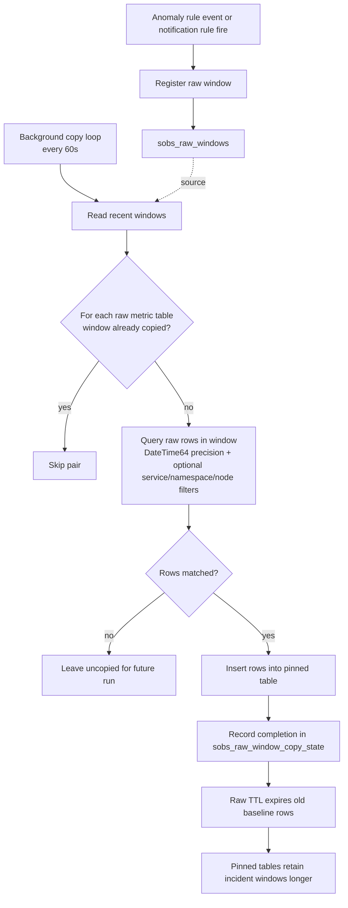

# Kubernetes Metrics Retention Window Design

## Context
Kubernetes metric ingest volume can become very high in short periods, especially when collectors include broad metric sets, high-cardinality attributes, and short collection intervals.

The current objective is to reduce storage while preserving investigative fidelity around meaningful events.

## Problem Statement
A simple fixed retention on raw metrics controls growth, but can discard the exact high-fidelity windows needed for root-cause analysis.

We need a low-complexity model that:
- bounds raw storage growth,
- preserves full-fidelity raw slices around alerts/anomalies/errors,
- avoids complicated conditional-TTL behavior.

## Goals
- Apply a baseline raw metrics TTL in hours.
- Preserve raw metrics for short windows around detected signals.
- Keep implementation simple, idempotent, and easy to operate.
- Support current Kubernetes scope narrowing (single namespace + node-related metrics).

## Non-Goals
- Dynamic row-level conditional TTL inside primary raw tables.
- Full historical raw retention.
- Complex policy engines in phase 1.

## Recommended Model (Phase 1)

### 1. Baseline raw retention
Apply a fixed TTL to raw metric tables:
- `otel_metrics_gauge`
- `otel_metrics_sum`
- `otel_metrics_histogram`

Initial default:
- baseline TTL: 48h (or 72h if a safer first step is preferred)

### 2. Event window preservation
When an error/anomaly/rule signal is produced, generate a raw preservation window:
- `window_start = signal_ts - 5 minutes`
- `window_end = signal_ts + 5 minutes`

Store window metadata in a small control table.

### 3. Pinned raw storage
Copy matching raw rows for each window into pinned raw tables with longer TTL:
- `otel_metrics_gauge_pinned`
- `otel_metrics_sum_pinned`
- `otel_metrics_histogram_pinned`

Initial default:
- pinned TTL: 14 days

### 4. Copy worker
Run a periodic worker (every 60s) that:
- reads uncopied windows,
- executes `INSERT INTO ... SELECT ...` from raw -> pinned over the time range,
- applies optional scope filters (`service`, `namespace`, `node`) when present,
- marks completion in copy-state table.

## Flow Diagram



### Notes
- Window registration is triggered by rule outcomes (notification and anomaly/tag-triggered agent flows).
- Detection logic is unchanged; this flow only affects retention and investigation fidelity.
- Copy-state is written only after successful row copy, so zero-row windows remain eligible for later runs.

## Why This Design
- Fastest path to control growth: fixed raw TTL is deterministic and immediate.
- Preserves evidence where it matters: only around meaningful signals.
- Operationally safe: avoids brittle conditional TTL logic.
- Easy rollback path: can disable window copy while keeping baseline TTL.

## Data Model Sketch

### Window registry
```sql
CREATE TABLE IF NOT EXISTS sobs_raw_windows (
  Id String,
  SignalTs DateTime64(9),
  WindowStart DateTime64(9),
  WindowEnd DateTime64(9),
  SignalType LowCardinality(String),
  SignalRef String,
  ServiceName LowCardinality(String),
  Namespace LowCardinality(String),
  NodeName LowCardinality(String),
  CreatedAt DateTime64(9) DEFAULT now64(9),
  Version UInt64 DEFAULT toUnixTimestamp64Milli(now64(9))
)
ENGINE = ReplacingMergeTree(Version)
ORDER BY (WindowStart, WindowEnd, SignalType, SignalRef, ServiceName);
```

### Copy-state tracker
```sql
CREATE TABLE IF NOT EXISTS sobs_raw_window_copy_state (
  WindowId String,
  SourceTable LowCardinality(String),
  LastCopiedAt DateTime64(9) DEFAULT now64(9),
  Version UInt64 DEFAULT toUnixTimestamp64Milli(now64(9))
)
ENGINE = ReplacingMergeTree(Version)
ORDER BY (WindowId, SourceTable);
```

### Baseline TTL
```sql
ALTER TABLE otel_metrics_gauge MODIFY TTL TimeUnixMs + INTERVAL 48 HOUR;
ALTER TABLE otel_metrics_sum MODIFY TTL TimeUnixMs + INTERVAL 48 HOUR;
ALTER TABLE otel_metrics_histogram MODIFY TTL TimeUnixMs + INTERVAL 48 HOUR;
```

### Pinned TTL
```sql
ALTER TABLE otel_metrics_gauge_pinned MODIFY TTL TimeUnixMs + INTERVAL 14 DAY;
ALTER TABLE otel_metrics_sum_pinned MODIFY TTL TimeUnixMs + INTERVAL 14 DAY;
ALTER TABLE otel_metrics_histogram_pinned MODIFY TTL TimeUnixMs + INTERVAL 14 DAY;
```

## Rollout Plan

### Step 1: Ingest reduction (already in progress)
- Narrow Kubernetes metrics to required families.
- Scope to a single namespace and node-related metrics.
- Increase collection interval where acceptable.
- Disable broad label/annotation extraction where not needed.

### Step 2: Baseline TTL
- Apply raw table TTL.
- Monitor row count and disk slope for 24h.

### Step 3: Window pinning
- Add window and copy-state tables.
- Create pinned metric tables.
- Add signal hook to register windows.
- Run periodic copy worker.

### Step 4: Verify + tune
- Validate incident investigations still have required raw detail.
- Tune baseline/pinned TTL and window width if needed.

## Operational Guardrails
- Keep copy worker idempotent.
- Use deterministic window IDs to prevent duplicate windows.
- Enforce max windows copied per run to avoid burst load.
- Add metrics:
  - windows_created_total
  - windows_copied_total
  - windows_copy_errors_total
  - pinned_rows_inserted_total
  - raw_rows_total_by_table

## Risks and Mitigations
- Risk: signal misses mean no preserved window.
  - Mitigation: keep a conservative baseline raw TTL (48h/72h).
- Risk: overlapping windows increase pinned volume.
  - Mitigation: window dedupe/merge by time overlap and scope.
- Risk: copy job lag during incident bursts.
  - Mitigation: bounded retries and backpressure counters.

## Success Criteria
- Raw table row growth plateaus according to configured baseline TTL.
- Investigations can retrieve full-fidelity raw data for recent incidents.
- Storage consumption is materially lower than pre-change baseline.
- No material regression in incident triage workflow.

## Open Questions
- Should severe incidents receive longer windows (for example +/-15m)?
- Should pinned retention vary by signal severity or environment?
- Do we also preserve linked logs/traces windows in phase 2?
